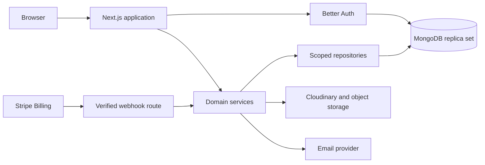

# Architecture

## Shape

Qenvaro is a modular monolith deployed as one Next.js application with MongoDB, Cloudinary product-image delivery, object storage for future private documents, transactional email, and Stripe Billing. Module boundaries keep domain logic extractable without paying the operational cost of microservices today.

## Request boundary

1. A Server Component, Server Action, or Route Handler reads the authenticated Better Auth session.
2. The tenant slug is resolved to an organization and membership. The resulting server-only `TenantContext` includes permissions and allowed stores.
3. A thin adapter validates input with Zod and calls a service.
4. The service enforces permissions, plan entitlements, invariants, and idempotency.
5. A repository constructs a query beginning with the trusted tenant scope and returns a projection.
6. Sensitive successful and rejected actions emit structured audit events without secret values.

Product images use an authenticated Route Handler because bounded multipart files exceed the normal Server Action contract. The adapter verifies same-origin browser requests and tenant access, Cloudinary performs the image upload/normalization, and the product-image service transactionally attaches only validated provider metadata. Provider/database partial failures use compensating deletion plus durable cleanup state.

First-workspace onboarding uses Better Auth to create the organization and owner membership, sets that organization on the authenticated session, then commits the tenant profile, first store, owner store assignment, signup-trial projection, and audit entry in one MongoDB transaction. A failed application transaction compensates by removing the just-created organization, so partial workspaces are not retained.

## Module boundary

Each real domain under `src/modules` owns its schemas, policies, calculations, and service orchestration. Shared infrastructure under `src/server` owns concerns that are domain-neutral: authentication, tenant context, database sessions, logging, email, and storage. Routes do not fetch the application's own HTTP API from the server.

## Reliability

- One cached `MongoClient` is shared per process.
- Ledger/projection workflows execute in retry-safe transactions.
- Event handlers keep provider event IDs and apply updates idempotently.
- Page sizes and export limits are bounded. Tenant-sensitive results are not globally cached.
- Health routes reveal liveness/readiness only, never connection strings or configuration.
