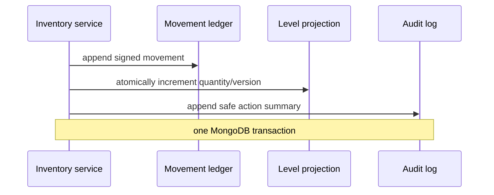

# Data model

Qenvaro uses opaque string identifiers and UTC `Date` values. Better Auth generates canonical UUID strings (rather than BSON UUID values) so organization IDs and application `tenantId` fields have one representation. Every tenant-owned document contains `tenantId`, `createdAt`, `updatedAt`, and relevant actor/version/archive metadata. Store-owned data also contains `storeId`. Money is `{ amountMinor: integer, currency: ISO-4217 }`.

`tenantProfiles` records the regional defaults and current entitlement projection. Signup onboarding creates an explicit 14-day `trialing` projection; active subscriptions and verified webhook projections replace that source later. Expired and suspended projections retain read access but reject mutations. A canceled Stripe subscription retains write access only until its verified current period end.

The dashboard is a read projection rather than a collection. It groups completed `sales` into 7- or 30-day tenant-timezone buckets for the active authorized store, compares at most eight authorized active stores, and reads at most eight allowlisted `auditLogs` from a 90-day window. A missing `grossProfitMinor` on any included sale makes the corresponding profit and margin unavailable rather than treating unknown cost as zero.

## Principal collections

| Area       | Collections                                                                                                                                                                                                                 |
| ---------- | --------------------------------------------------------------------------------------------------------------------------------------------------------------------------------------------------------------------------- |
| Identity   | Better Auth `user`, `session`, `account`, `verification`, `twoFactor`, `organization`, `member`, `invitation`; `tenantProfiles`, `stores`, `memberStoreAssignments`, `invitationStoreAssignments`, `sessionStoreSelections` |
| Billing    | Better Auth `subscription`; entitlement fields on `tenantProfiles`; `usageCounters`, `billingEvents`, `webhookEvents`                                                                                                       |
| Platform   | `platformSessionAssurances`, `platformAuditLogs`; aggregate reads over identity, tenant entitlement, subscription, verified-webhook, and migration metadata                                                                 |
| Catalog    | `products`, `productVariants`, `productImages`, `categories`, `tags`, `units`, `taxRates`                                                                                                                                   |
| Inventory  | `inventoryLevels`, `inventoryMovements`, `stockAdjustments`, `stockTransfers`                                                                                                                                               |
| Sales/CRM  | `customers`, `sales`, `salePayments`, `returns`, `refunds`, `receipts`                                                                                                                                                      |
| Purchasing | `suppliers`, `purchaseOrders`, `goodsReceipts`                                                                                                                                                                              |
| People     | `employees`, `attendanceRecords`, `leaveRequests`, `salaryProfiles`, `payrollRuns`, `payrollItems`, `payslips`                                                                                                              |
| Operations | `expenses`, `notifications`, `auditLogs`, `sequenceCounters`, `productImportPreviews`, `importExportJobs`, `applicationRateLimits`, `mediaCleanupTasks`                                                                     |

Bounded historical snapshots (sale lines, purchase lines, payroll summary lines) are embedded and immutable. Independently queried or frequently updated data stays in separate collections.

Product catalog records carry an integer `version`. Detail reads scope the product, variants, stores, and inventory levels by the server-derived tenant context; inventory totals include only stores authorized for the current membership. Catalog edits compare the submitted expected version inside the transaction, update the product and its default variant together, and increment both versions. Archive is an idempotent product lifecycle transition: it marks the product and linked variants, appends an audit event, and never changes or removes `inventoryLevels` or `inventoryMovements`.

`categories` stores the tenant taxonomy authority with normalized name, stable slug, description, lifecycle status, and integer version. Migration 8 backfills records from existing product category strings. Active and draft products retain the canonical category name for indexed filtering. A category rename updates those assignments and increments their product versions inside the category transaction; archived products keep the prior name as a historical snapshot. Category archive is idempotent and is rejected while active or draft products remain assigned.

`tags` stores reusable merchandising labels with a normalized tenant-unique name, stable opaque identifier, display color, lifecycle status, and integer version. Products carry up to 20 stable tag IDs, which lets tag names and colors change without rewriting product documents. Reads resolve labels inside the server-derived tenant scope. Only active tags can be assigned, and archive is idempotent but rejected while an active or draft product references the tag. Archived products retain their historical assignments. Migration 9 backfills empty product tag arrays and creates the tag lifecycle indexes.

`units` stores reusable quantity labels with independently normalized tenant-unique names and symbols, stable opaque identifiers, descriptions, lifecycle status, and optimistic versions. Products reference one stable `unitId`, so label changes do not rewrite product records. Only active same-tenant units can be assigned; archive is idempotent and rejected while an active or draft product references the unit. Onboarding creates `Each (ea)` as the default, and product/CSV creation resolves a default transactionally. Migration 16 creates a default for every existing tenant, backfills unassigned products, and adds unit and product-assignment indexes. Inventory quantities remain integers in this phase; a unit labels the quantity and does not enable fractional stock.

`customers` stores tenant-owned customer identity with a server-generated stable code, name, optional company/contact/address/notes, lifecycle status, and optimistic version. Normalized name, email, and phone fields support bounded tenant search but are never client-controlled identity or uniqueness claims. Names and contact details may legitimately overlap both within and across tenants. Archive is idempotent, blocks later edits, and preserves the stable record for future historical sales references. Customer audit events retain only the code, lifecycle status, available contact-method types, and company-presence flag; they omit names, contact details, addresses, and notes. Migration 17 backfills legacy customer records and adds the lifecycle query indexes.

`sales` is a completed commercial record rather than a mutable browser cart. It embeds immutable store, optional customer, and line snapshots plus server-derived subtotal, discount, tax, pre-tax net total, total, tendered amount, change, and nullable gross profit. Separate `salePayments` records retain the recorded method, tendered/applied amounts, provider kind, and status; they never contain credentials. Each issued `receipt` provides a tenant/store-scoped sequential display number and evidence for one sale. The same transaction allocates that number, creates the sale/payment/receipt records, calls the inventory service for each tracked line, updates the product revenue projection, and appends a safe audit. A request fingerprint permits only an exact idempotent replay. Migration 18 adds product tax/tracking defaults and sale/payment/receipt indexes; migration 19 adds the bounded variant-first POS catalog index.

Products embed up to three option groups with stable option/value identifiers, current display labels, and lifecycle metadata. Sellable `productVariants` reference one value from every active group and store an immutable option signature; label changes resolve at read time without rewriting variant identity. The base/default variant mirrors the product SKU and price, while additional variants carry independent SKU, price, status, and version fields. Additional variants start with zero stock. Variant archive is idempotent, retains SKU/combination reservations and history, and is rejected while any tenant inventory projection is non-zero. Option groups cannot be added after active combinations exist, and cannot be archived while active variants reference them. Migration 10 backfills lifecycle fields and creates combination/status indexes.

`productImages` stores Cloudinary identifiers and delivery metadata, never image binaries or credentials. Each tenant/product gallery is capped at eight active images with explicit position, one partial-unique primary image, required alternative text, lifecycle status, and optimistic version. The first upload is primary automatically; primary selection, alternative-text edits, reorder, and removal update the product version and append audit events transactionally. Removal archives metadata before requesting Cloudinary deletion and promotes the next image without touching inventory. Failed provider cleanup remains durably marked on the archived image; a failed compensating delete after an unsuccessful database attach is recorded in `mediaCleanupTasks`. Migration 11 adds tenant/order, primary, provider-identity, and cleanup indexes.

`productImportPreviews` stores only bounded parsed CSV values and validated mutation intent; it does not store a binary file. Every preview belongs to one tenant and user, expires after 30 minutes, carries an optimistic version, and records the chosen mapping and existing-SKU behavior. A successful commit converts the preview into an idempotent completed result and writes a durable `importExportJobs` summary plus audit records in the same transaction as catalog changes. New-product opening stock uses the append-only inventory ledger and projection; updates and skips never alter inventory. Migration 12 adds preview TTL and tenant job indexes. `applicationRateLimits` contains short-lived fixed-window counters for application routes such as CSV operations; migration 13 adds TTL cleanup.

`inventoryMovements` is the immutable stock source of truth. Every entry identifies its tenant, store, product variant, signed quantity delta, resulting quantity, source record, note, actor, occurrence time, and unique request-derived idempotency key. `inventoryLevels` is the tenant/store/variant read projection and carries an optimistic integer version. `stockAdjustments` retains the posted mode, reason, entered quantity, signed delta, before/after counts, note, actor, and request identity. `stockTransfers` is a completed immutable header with source/destination stores and up to 20 embedded line snapshots; each line records the SKU quantity and both stores' before/after counts. One transaction writes the transfer header, paired `transfer_out`/`transfer_in` movements, both projections, and audit event. Transfers never change tenant-wide product stock. Migration 14 backfills projection versions and the default no-negative-stock setting, then adds adjustment/transfer idempotency and inventory reporting indexes.

Product `allowedStoreIds` is the store-availability projection. For compatibility, a missing or empty value means all current active stores; the first managed update persists an explicit active-store list. Scoped updates preserve active stores outside the current member's assignments. A store cannot be removed while any linked product variant has a non-zero level there, and successful changes increment the product version and append an audit. `tenantProfiles.inventorySettings.lowStockAlerts` stores enabled/low/out flags and an independent optimistic version. Alert rows are not duplicated documents: they are derived from the active authorized store's current levels, product reorder values, active lifecycle state, and tenant policy. Migration 15 backfills the disabled-by-default policy and adds the product availability query index.

## Important indexes

All tenant query indexes begin with `tenantId`. The migration runner creates and versions:

- unique organization slug;
- unique tenant-profile slug and a billing-status/trial-expiry scan;
- unique active `tenantId + store code`;
- unique session and tenant active-store selection;
- unique tenant, invitation, and store pending grant;
- organization, invitation status, and expiry scans for capacity and cleanup;
- unique active `tenantId + normalized SKU` and partial unique `tenantId + barcode`;
- unique `tenantId + normalized variant SKU`, unique `tenantId + productId + option signature`, and `tenantId + productId + variant status + updatedAt` variant lifecycle queries;
- `tenantId + productId + image status + position`, a partial unique active primary image, unique tenant Cloudinary public ID, and pending provider-cleanup scans;
- `tenantId + userId + import status + updatedAt`, preview TTL expiry, and `tenantId + import/export type + createdAt` job history;
- unique `tenantId + storeId + variantId` inventory projection;
- `tenantId + status + updatedAt` and `tenantId + category + status` product lists;
- unique active `tenantId + normalized category name`, stable category slug, and `tenantId + category status + updatedAt` taxonomy queries;
- unique active `tenantId + normalized tag name`, `tenantId + tag status + updatedAt` tag queries, and `tenantId + tagIds + product status` assignment filtering;
- unique active `tenantId + normalized unit name`, unique active `tenantId + normalized unit symbol`, `tenantId + unit status + updatedAt` unit queries, and `tenantId + unitId + product status` assignment filtering;
- unique active `tenantId + customer code`, plus tenant customer name/status, created-time, and updated-time list queries;
- `tenantId + product status + product name` and `tenantId + variant status + SKU + product` bounded POS catalog access;
- `tenantId + storeId + occurredAt` inventory ledger/report queries;
- `tenantId + variantId + occurredAt` variant ledger queries and `tenantId + storeId + quantity` stock-attention scans;
- unique `tenantId + idempotencyKey` adjustment and transfer requests, plus store/date adjustment and transfer-history indexes;
- `tenantId + allowedStoreIds + status + name` product availability queries;
- unique provider and event ID for webhook replay protection;
- unique Stripe subscription identity, tenant subscription-status scans, unique billing event identity, and webhook processing-status scans;
- platform user-role, tenant billing/plan, and verified-webhook scans;
- unique current-session platform 2FA assurance with TTL expiry and idempotent platform bootstrap audit identity;
- TTL expiry for persistent application request-throttle buckets;
- unique `tenantId + storeId + sequence type` counters;
- `tenantId + storeId + completedAt` bounded sales/dashboard scans and unique tenant/store sale receipt numbers;
- `tenantId + saleId + recordedAt` payment history, unique tenant/sale receipt evidence, and unique tenant/store receipt display numbers;
- `tenantId + createdAt` append-only audit scans.

Soft-deleted records use partial unique indexes where MongoDB supports the lifecycle query. Repository tests prove scopes and uniqueness with overlapping tenant data.

## Inventory transaction

Direct projection updates are forbidden outside the inventory service. Completed commercial records are reversed, refunded, voided, or archived rather than deleted.
