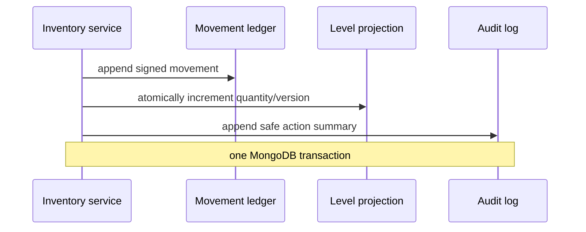

# Data model

Qenvaro uses opaque string identifiers and UTC `Date` values. Better Auth generates canonical UUID strings (rather than BSON UUID values) so organization IDs and application `tenantId` fields have one representation. Every tenant-owned document contains `tenantId`, `createdAt`, `updatedAt`, and relevant actor/version/archive metadata. Store-owned data also contains `storeId`. Money is `{ amountMinor: integer, currency: ISO-4217 }`.

`tenantProfiles` records the regional defaults and current entitlement projection. Signup onboarding creates an explicit 14-day `trialing` projection; active subscriptions and verified webhook projections replace that source later. Expired, canceled, and suspended projections retain read access but reject mutations.

## Principal collections

| Area       | Collections                                                                                                                                                                                                    |
| ---------- | -------------------------------------------------------------------------------------------------------------------------------------------------------------------------------------------------------------- |
| Identity   | Better Auth `user`, `session`, `account`, `verification`, `organization`, `member`, `invitation`; `tenantProfiles`, `stores`, `memberStoreAssignments`, `invitationStoreAssignments`, `sessionStoreSelections` |
| Billing    | `planCatalog`, `subscriptionProjections`, `usageCounters`, `billingEvents`, `webhookEvents`                                                                                                                    |
| Catalog    | `products`, `productVariants`, `categories`, `tags`, `units`, `taxRates`                                                                                                                                       |
| Inventory  | `inventoryLevels`, `inventoryMovements`, `stockAdjustments`, `stockTransfers`                                                                                                                                  |
| Sales/CRM  | `customers`, `sales`, `salePayments`, `returns`, `refunds`, `receipts`                                                                                                                                         |
| Purchasing | `suppliers`, `purchaseOrders`, `goodsReceipts`                                                                                                                                                                 |
| People     | `employees`, `attendanceRecords`, `leaveRequests`, `salaryProfiles`, `payrollRuns`, `payrollItems`, `payslips`                                                                                                 |
| Operations | `expenses`, `notifications`, `auditLogs`, `sequenceCounters`, `importExportJobs`                                                                                                                               |

Bounded historical snapshots (sale lines, purchase lines, payroll summary lines) are embedded and immutable. Independently queried or frequently updated data stays in separate collections.

## Important indexes

All tenant query indexes begin with `tenantId`. The migration runner creates and versions:

- unique organization slug;
- unique tenant-profile slug and a billing-status/trial-expiry scan;
- unique active `tenantId + store code`;
- unique session and tenant active-store selection;
- unique tenant, invitation, and store pending grant;
- organization, invitation status, and expiry scans for capacity and cleanup;
- unique active `tenantId + normalized SKU` and partial unique `tenantId + barcode`;
- unique `tenantId + storeId + variantId` inventory projection;
- `tenantId + status + updatedAt` and `tenantId + categoryId + status` catalog lists;
- `tenantId + storeId + occurredAt` inventory ledger/report queries;
- unique provider and event ID for webhook replay protection;
- unique `tenantId + storeId + sequence type` counters;
- `tenantId + createdAt` append-only audit scans.

Soft-deleted records use partial unique indexes where MongoDB supports the lifecycle query. Repository tests prove scopes and uniqueness with overlapping tenant data.

## Inventory transaction

Direct projection updates are forbidden outside the inventory service. Completed commercial records are reversed, refunded, voided, or archived rather than deleted.
