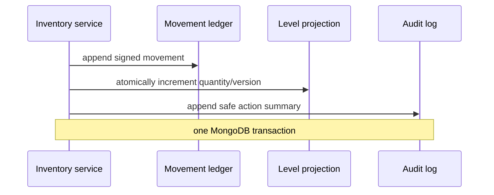

# Data model

Qenvaro uses opaque string identifiers and UTC `Date` values. Better Auth generates canonical UUID strings (rather than BSON UUID values) so organization IDs and application `tenantId` fields have one representation. Every tenant-owned document contains `tenantId`, `createdAt`, `updatedAt`, and relevant actor/version/archive metadata. Store-owned data also contains `storeId`. Money is `{ amountMinor: integer, currency: ISO-4217 }`.

`tenantProfiles` records the regional defaults and current entitlement projection. Signup onboarding creates an explicit 14-day `trialing` projection; active subscriptions and verified webhook projections replace that source later. Expired and suspended projections retain read access but reject mutations. A canceled Stripe subscription retains write access only until its verified current period end.

## Principal collections

| Area       | Collections                                                                                                                                                                                                                 |
| ---------- | --------------------------------------------------------------------------------------------------------------------------------------------------------------------------------------------------------------------------- |
| Identity   | Better Auth `user`, `session`, `account`, `verification`, `twoFactor`, `organization`, `member`, `invitation`; `tenantProfiles`, `stores`, `memberStoreAssignments`, `invitationStoreAssignments`, `sessionStoreSelections` |
| Billing    | Better Auth `subscription`; entitlement fields on `tenantProfiles`; `usageCounters`, `billingEvents`, `webhookEvents`                                                                                                       |
| Platform   | `platformSessionAssurances`, `platformAuditLogs`; aggregate reads over identity, tenant entitlement, subscription, verified-webhook, and migration metadata                                                                 |
| Catalog    | `products`, `productVariants`, `categories`, `tags`, `units`, `taxRates`                                                                                                                                                    |
| Inventory  | `inventoryLevels`, `inventoryMovements`, `stockAdjustments`, `stockTransfers`                                                                                                                                               |
| Sales/CRM  | `customers`, `sales`, `salePayments`, `returns`, `refunds`, `receipts`                                                                                                                                                      |
| Purchasing | `suppliers`, `purchaseOrders`, `goodsReceipts`                                                                                                                                                                              |
| People     | `employees`, `attendanceRecords`, `leaveRequests`, `salaryProfiles`, `payrollRuns`, `payrollItems`, `payslips`                                                                                                              |
| Operations | `expenses`, `notifications`, `auditLogs`, `sequenceCounters`, `importExportJobs`                                                                                                                                            |

Bounded historical snapshots (sale lines, purchase lines, payroll summary lines) are embedded and immutable. Independently queried or frequently updated data stays in separate collections.

Product catalog records carry an integer `version`. Detail reads scope the product, variants, stores, and inventory levels by the server-derived tenant context; inventory totals include only stores authorized for the current membership. Catalog edits compare the submitted expected version inside the transaction, update the product and its default variant together, and increment both versions. Archive is an idempotent product lifecycle transition: it marks the product and linked variants, appends an audit event, and never changes or removes `inventoryLevels` or `inventoryMovements`.

`categories` stores the tenant taxonomy authority with normalized name, stable slug, description, lifecycle status, and integer version. Migration 8 backfills records from existing product category strings. Active and draft products retain the canonical category name for indexed filtering. A category rename updates those assignments and increments their product versions inside the category transaction; archived products keep the prior name as a historical snapshot. Category archive is idempotent and is rejected while active or draft products remain assigned.

## Important indexes

All tenant query indexes begin with `tenantId`. The migration runner creates and versions:

- unique organization slug;
- unique tenant-profile slug and a billing-status/trial-expiry scan;
- unique active `tenantId + store code`;
- unique session and tenant active-store selection;
- unique tenant, invitation, and store pending grant;
- organization, invitation status, and expiry scans for capacity and cleanup;
- unique active `tenantId + normalized SKU` and partial unique `tenantId + barcode`;
- unique `tenantId + storeId + variantId` inventory projection;
- `tenantId + status + updatedAt` and `tenantId + category + status` product lists;
- unique active `tenantId + normalized category name`, stable category slug, and `tenantId + category status + updatedAt` taxonomy queries;
- `tenantId + storeId + occurredAt` inventory ledger/report queries;
- unique provider and event ID for webhook replay protection;
- unique Stripe subscription identity, tenant subscription-status scans, unique billing event identity, and webhook processing-status scans;
- platform user-role, tenant billing/plan, and verified-webhook scans;
- unique current-session platform 2FA assurance with TTL expiry and idempotent platform bootstrap audit identity;
- unique `tenantId + storeId + sequence type` counters;
- `tenantId + createdAt` append-only audit scans.

Soft-deleted records use partial unique indexes where MongoDB supports the lifecycle query. Repository tests prove scopes and uniqueness with overlapping tenant data.

## Inventory transaction

Direct projection updates are forbidden outside the inventory service. Completed commercial records are reversed, refunded, voided, or archived rather than deleted.
