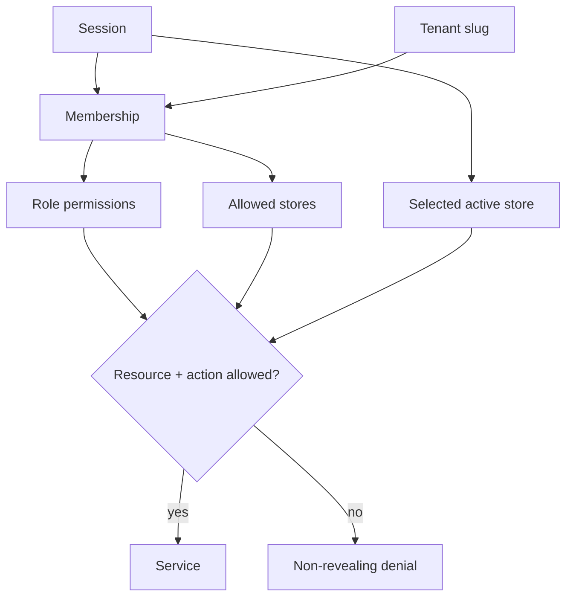

# Authorization model

Global platform roles and tenant roles are separate. `PLATFORM_SUPER_ADMIN` is server-controlled, seeded from configured emails, requires 2FA, and is never accepted from registration or profile input.

Tenant roles are Business Owner, Admin, Manager, Cashier, Inventory Manager, HR Manager, Accountant, Employee, and Viewer. Roles expand into resource/action permissions; domain code checks permissions, not role-name branches. Store assignments further narrow applicable actions.

Business and Enterprise tenants may define custom operational roles. These roles supplement a member’s fixed base role and are restricted to a code-owned allowlist. They cannot grant tenant ownership/deletion, billing, membership administration, settings administration, or platform authority, and the assigning actor cannot grant a permission they do not already hold. Assignments are ignored if the tenant later loses the plan feature.

Key restrictions include:

- only owners manage billing, transfer ownership, or request tenant deletion; ownership transfer additionally requires current-session 2FA and exact confirmation of an existing verified target member's email;
- the final owner cannot be removed;
- owners are protected from role and removal changes in ordinary team settings;
- new members require at least one explicit active-store assignment, and pending invitation grants do not become active until acceptance;
- compensation requires `compensation:read/manage`, independent of general employee access;
- employees can read only their linked records and own payslips;
- sale refunds, stock adjustments, role changes, payroll transitions, and support access are audited;
- product option and variant creation/editing requires `product:update`, while zero-stock variant and unused-option archive requires `product:archive`;
- unit creation requires `product:create`, unit edits and product assignment require `product:update`, and only an unassigned unit can be archived with `product:archive`;
- customer lists require `customer:read`, creation/edit/archive require their matching customer permissions, and archived profiles remain read-only for historical references;
- the cashier catalog and barcode/SKU scan lookup require `sale:create`, completion independently requires `sale:complete`, and issued/printable bills require `sale:read`; all three remain limited to an assigned active store and none are inferred from UI visibility;
- completed sales history and sale/return receipt reads require `sale:read` and are limited to assigned stores; creating a return or void additionally requires `sale:refund`, write entitlement, and the original assigned store to remain active. Void is further limited to manual-provider sales without completed returns and requires the exact receipt number;
- inventory pages require `inventory:read`; immutable manual adjustments require `inventory:adjust`; and both stores in a transfer require assignment plus `inventory:transfer`;
- product availability changes require `product:update` and are limited to assigned active stores, while the tenant-wide low-stock policy requires `settings:manage`;
- dashboard sales totals, trends, and authorized-store comparisons require `sale:read` or `report:read`; recent activity additionally requires `audit:read`, and restricted panels render a denial state rather than placeholder totals;
- sales and operations reports require `report:read` independently of cashier access, accept only active assigned stores, and never broaden scope from URL parameters or navigation visibility; CSV generation additionally requires `report:export` and creates audit/job evidence;
- global search includes a resource provider only when its matching read permission is present, caps results per provider, and preserves tenant and assigned-store scope;
- UI gates improve usability but never replace service authorization.

Break-glass support is a separate, disabled-by-default capability. It requires a reason, a 15–120 minute expiry, visible grant state, revocation, and append-only audit trail. Platform metadata access or an active grant alone never creates an unrestricted tenant product, customer, sales, employee, or compensation browser.
