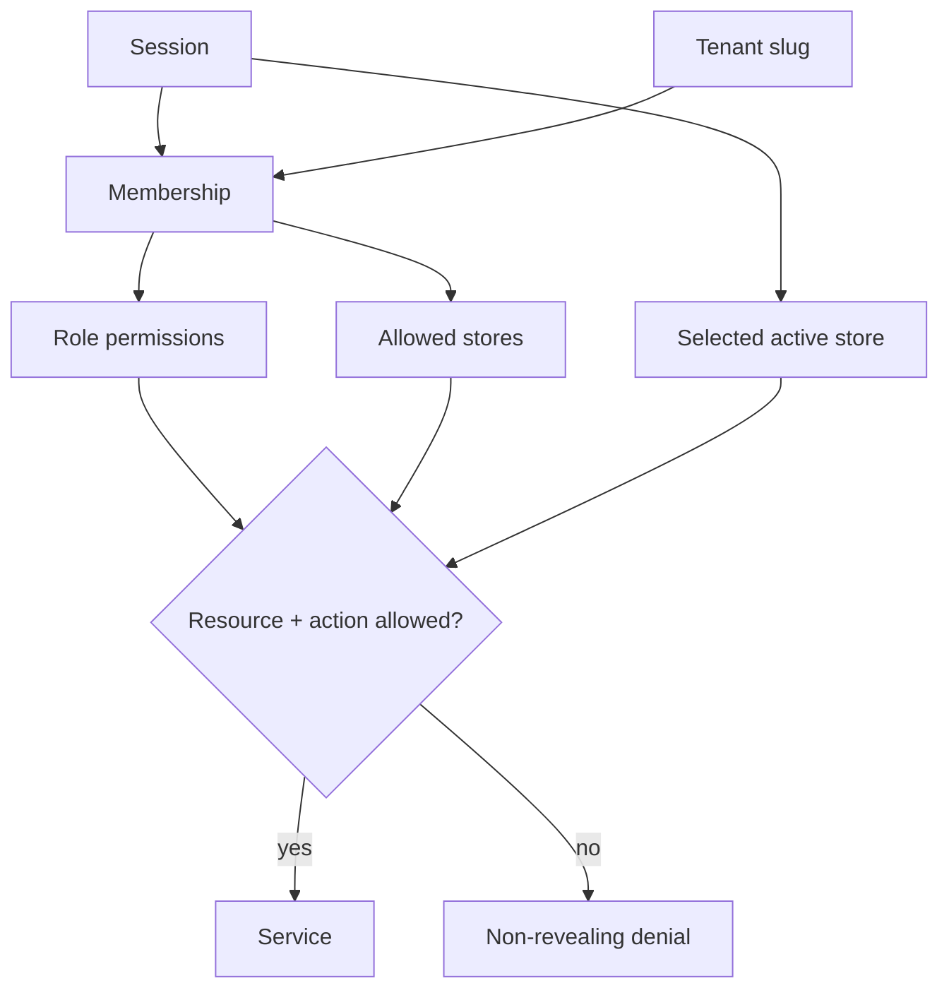

# Authorization model

Global platform roles and tenant roles are separate. `PLATFORM_SUPER_ADMIN` is server-controlled, seeded from configured emails, requires 2FA, and is never accepted from registration or profile input.

Tenant roles are Business Owner, Admin, Manager, Cashier, Inventory Manager, HR Manager, Accountant, Employee, and Viewer. Roles expand into resource/action permissions; domain code checks permissions, not role-name branches. Store assignments further narrow applicable actions.

Key restrictions include:

- only owners manage billing, transfer ownership, or request tenant deletion;
- the final owner cannot be removed;
- owners are protected from role and removal changes in ordinary team settings;
- new members require at least one explicit active-store assignment, and pending invitation grants do not become active until acceptance;
- compensation requires `compensation:read/manage`, independent of general employee access;
- employees can read only their linked records and own payslips;
- sale refunds, stock adjustments, role changes, payroll transitions, and support access are audited;
- product option and variant creation/editing requires `product:update`, while zero-stock variant and unused-option archive requires `product:archive`;
- inventory pages require `inventory:read`; immutable manual adjustments require `inventory:adjust`; and both stores in a transfer require assignment plus `inventory:transfer`;
- UI gates improve usability but never replace service authorization.

Break-glass support is a separate, disabled-by-default capability. It requires a reason, short expiry, visible banner, revocation, and append-only audit trail. Platform metadata access alone never implies access to tenant products, customers, sales, or compensation.
